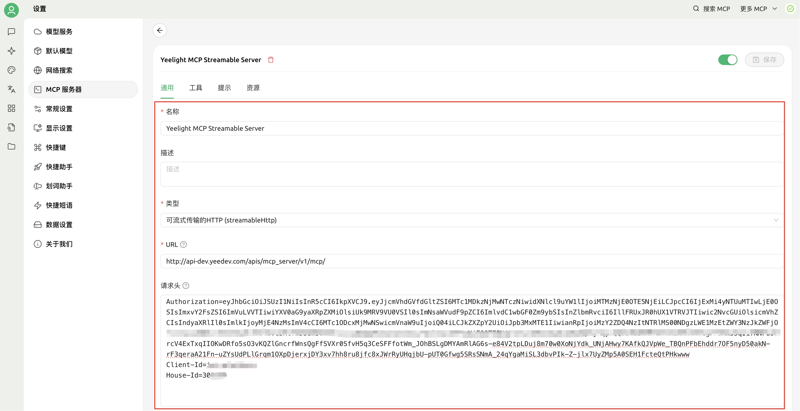

<p align="center">
  <a href="https://cn.yeelight.com/" target="_blank">
    
  </a>
</p>

# Yeelight MCP Server

## 项目介绍
Yeelight MCP Server 是一个基于 [MCP（Model Context Protocol）](https://modelcontextprotocol.io/introduction)协议开发的智能照明控制服务。该服务旨在为 AI 助手、智能代理（Agent，如Claude Desktop、Cursor、Cherry Studio等）或其他支持 MCP 协议的客户端提供统一的接口，使其能够与 Yeelight Pro 系列智能设备进行高效交互。

通过接入 Yeelight MCP Server，您可以使用自然语言完成智能设备控制、设备状态查询、预设情景执行等操作，协助您打造更智能、更自然的人机交互体验。


## 功能特性

- 💡 智能设备控制。

包括但不限于：开关控制、亮度调节、颜色与色温设置、窗帘控制、多通道设备控制等

- 🔍 状态查询能力

提供实时设备状态读取接口，支持查询当前开关状态、亮度、色温、色值、在线状态等关键信息。

- 🌈 情景模式执行

支持预设情景（Scene）触发与执行，可用于实现灯光联动、氛围营造等多设备协调控制。

- 🛠️ 易于扩展与集成
    - 支持本地源码部署：开源代码可在本地独立部署，支持内网运行，无需依赖云服务，适合对数据隐私、安全性有更高要求的用户或企业。    
	- 支持链接远程官方服务：可选择接入 Yeelight 官方云平台，实现设备远程控制、跨网络访问、无感发现等功能，提升灵活性和可维护性。

- 🤖 AI友好设计

全面遵循MCP协议，提供Streamable Http接口，接口定义清晰、响应结构标准化，天然适配大语言模型（LLM）调用逻辑。支持与 Claude、Cursor、LangChain等主流Agent框架对接，助力 AI 助手高效理解与操作设备。

- 📦 高兼容性

全面遵循MCP协议，接口定义清晰、响应结构标准化，天然适配大语言模型（LLM）调用逻辑。支持与Claude、Cursor、LangChain等主流 Agent 框架对接，助力AI助手高效理解与操作设备。


## 快速开始
Yeelight MCP Server 支持两种接入方式：**官方远程MCP Server接入** 和 **本地源码接入**。用户可根据自身需求和技术背景，选择适合的方式快速集成与使用。


#### 📌 前置准备
在开始接入之前，您需要准备好的`Authorization（访问令牌）`、`Client-Id` 和 `House-Id`信息。

- 访问令牌（AccessToken）获取

请参考[易来开放平台文档 §2.1](https://open-console.yeelight.com/commerical-lighting-open-platform-docs.html)获取详细的令牌获取方法。

- houseId的获取

Yeelight Pro 用户可登录 Yeelight Pro APP，依次进入 【家庭管理】→【选择家庭】，即可查看对应的 houseId：

<p align="center">
  
</p>

- clientId获取

clientId是申请访问令牌（AccessToken）时所需的必要参数，具体申请方式同样参考[易来开放平台文档 §2.1](https://open-console.yeelight.com/commerical-lighting-open-platform-docs.html)。


### 🛰️ 方式一：集成Yeelight官方远程MCP Server（推荐）

对于希望快速接入Yeelight Pro智能设备控制能力的用户，可直接通过MCP协议连接Yeelight官方提供的MCP Streamable HTTP服务。该方式无需本地部署，配置简洁，接入高效。

**官方MCP Server服务地址**
`https://api.yeelight.com/apis/mcp_server/v1/mcp/`  


### 🖥️ 方式二：本地源码部署


1. 安装uv

👉 参考 [uv 安装指南](https://hellowac.github.io/uv-zh-cn/getting-started/installation/)。

```shell 
# 命令适用于linux、macOS。 Windows安装参考官方安装指南。
curl -Ls https://astral.sh/uv/install.sh | sh
```

2. 克隆源码

```shell 
# 克隆源码
git clone https://github.com/Justin-Well/yeelight-iot-mcp.git
# 进入项目目录
cd yeelight-mcp
```
3. 创建并激活虚拟环境
```shell 
uv venv .venv
source .venv/bin/activate
```
4. 安装依赖
```shell 
uv pip install ./
```
5. 启动服务
```shell 
./service.sh start      # 启动服务
./service.sh status     # 查看服务状态
./service.sh stop       # 停止服务
```

### 🧩 客户端配置

Yeelight MCP Server 采用 Streamable HTTP 协议 进行接入，目前主流 AI 客户端均已支持基于该协议的 MCP 接口调用。接入时，您只需将 `Authorization`、`Client-Id` 和 `House-Id` 作为请求 Header 传入即可。

以下为部分客户端的配置示例，供参考：


> 📌 说明
> - 若使用本地部署，请将 url 替换为实际地址，如 http://{ip}:{port}/mcp。
> - 替换 ${...} 中的占位符为您实际的配置信息。


#### Cursor接入
Cursor MCP配置文件示例：
```JSON
{
  "mcpServers": {
    "yeelight-remote-iot-mcp-server": {
      "url": "https://api.yeelight.com/apis/mcp_server/v1/mcp/", 
      "headers": {
        "Authorization": "${Authorization}",
        "Client-Id": "${Client_Id}",
        "House-Id": "${HOUSEI_Id}"
      }
    }
  }
}
```


#### Claude Desktop接入
Claude Desktop MCP配置文件示例：
```JSON
{
  "yeelight-remote-iot-mcp-server": {
    "command": "npx",
    "args": [
      "mcp-remote",
      "https://api.yeelight.com/apis/mcp_server/v1/mcp/",
      "--header",
      "Authorization:${Authorization}",
      "--header",
      "Client-Id:${CLIENT_ID}",
      "--header",
      "House-Id:${HOUSE_ID}",
      "--allow-http",
      "true"
    ],
    "env": {
      "AUTHORIZATION": "${ACCESS_TOKEN}",
      "CLIENT_ID": "${CLIENT_ID}",
      "HOUSE_ID": "${HOUSEI_Id}"
    }
  }
}
```

#### Cherry Studio接入
打开Cherry Studio页面，依次点击 【设置】→【MCP服务器】→【添加服务器】，填写 `Authorization`、`Client-Id` 和 `House-Id` 信息，如下图所示：
<p align="center">
  
</p>


## 使用示例

以下示例展示了将Yeelight MCP Server接入到主流AI客户端后，通过自然语言与Yeelight Pro或商照智能设备进行便捷互动。

<div align="center">
  <table width="70%">
    <tr>
      <td align="center">
        Claude Desktop<br>
        
      </td>
    </tr>
    <tr>
      <td align="center">
        Cursor<br>
        
      </td>
    </tr>
    <tr>
      <td align="center">
        Cherry Studio<br>
        
      </td>
    </tr>
  </table>
</div>

