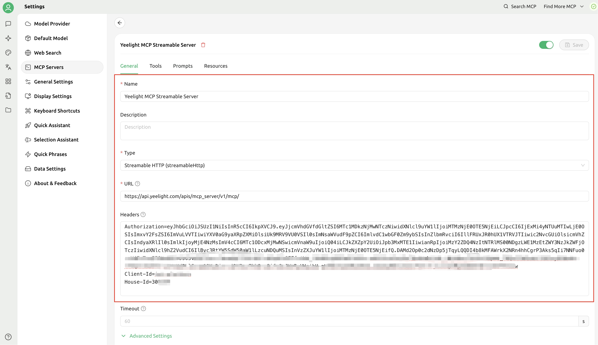
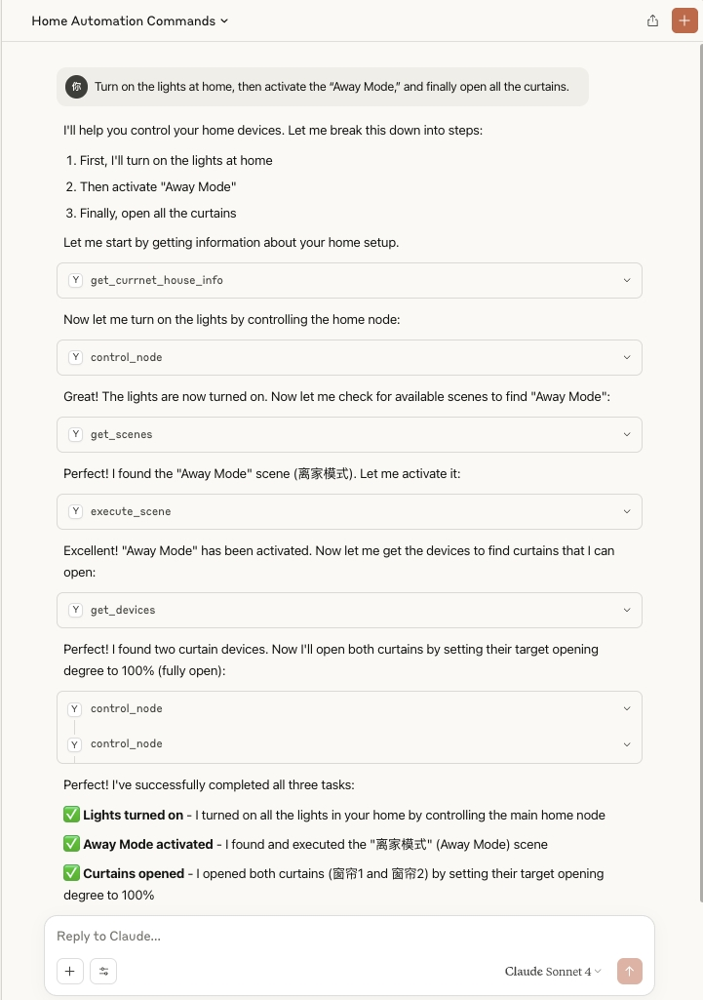
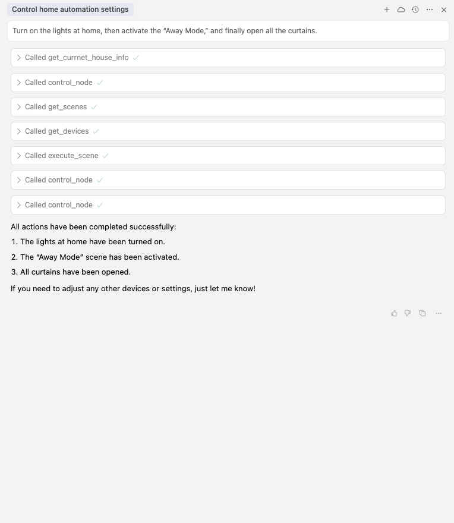
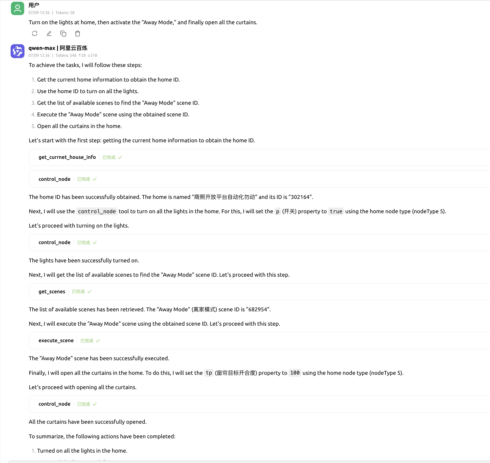

<p align="center">
  <a href="https://cn.yeelight.com/" target="_blank">
    
  </a>
</p>

<p align="center">
  English | <a href="/README.md">中文</a>
</p>

# Yeelight MCP Server

## Project Introduction
Yeelight MCP Server is an intelligent lighting control service developed based on the [MCP (Model Context Protocol)](https://modelcontextprotocol.io/introduction). This service is designed to provide a unified interface for AI assistants, intelligent agents (such as Claude Desktop, Cursor, Cherry Studio, etc.), or other clients supporting the MCP protocol, enabling efficient interaction with Yeelight Pro series smart devices.

By connecting to the Yeelight MCP Server, you can use natural language to control smart devices, query device status, execute preset scenes, and more, helping you create a smarter and more natural human-computer interaction experience.


## Features

- 💡 Smart Device Control

Including but not limited to: switch control, brightness adjustment, color and color temperature settings, curtain control, multi-channel device control, etc.

- 🔍 Status Query Capability

Provides real-time device status reading interface, supporting queries for current switch status, brightness, color temperature, color value, online status, and other key information.

- 🌈 Scene Mode Execution

Supports triggering and executing preset scenes, which can be used for lighting linkage, atmosphere creation, and coordinated control of multiple devices.

- 🛠️ Easy to Extend and Integrate
    - Supports local source code deployment: The open-source code can be deployed locally and run on an intranet, without relying on cloud services, suitable for users or enterprises with higher requirements for data privacy and security.
    - Supports connecting to the official Yeelight cloud service: You can choose to connect to the Yeelight official cloud platform to achieve remote device control, cross-network access, seamless discovery, and more, enhancing flexibility and maintainability.

- 🤖 AI-Friendly Design

Fully compliant with the MCP protocol, provides Streamable HTTP interface, clear interface definitions, standardized response structures, and is naturally compatible with large language model (LLM) invocation logic. Supports integration with mainstream agent frameworks such as Claude, Cursor, LangChain, helping AI assistants efficiently understand and operate devices.

- 📦 High Compatibility

Fully compliant with the MCP protocol, with clear interface definitions and standardized response structures, naturally compatible with LLM invocation logic. Supports integration with mainstream agent frameworks such as Claude, Cursor, LangChain, helping AI assistants efficiently understand and operate devices.


## Quick Start
Yeelight MCP Server supports two access methods: **Official Remote MCP Server Access** and **Local Source Code Deployment**. Users can choose the appropriate method for quick integration and use according to their needs and technical background.


#### 📌 Prerequisites
Before starting, you need to prepare the `Authorization (Access Token)`, `Client-Id`, and `House-Id` information.

- Access Token Acquisition

Please refer to [Yeelight Open Platform Documentation §2.1](https://open-console.yeelight.com/open-platform-docs-en.html) for detailed token acquisition methods.

- HouseId Acquisition

Yeelight Pro users can log in to the Yeelight Pro APP, go to [Home Management] → [Select Home], and view the corresponding houseId:

<p align="center">
  
</p>

- ClientId Acquisition

ClientId is a necessary parameter when applying for an access token (AccessToken). For specific application methods, please also refer to [Yeelight Open Platform Documentation §2.1](https://open-console.yeelight.com/open-platform-docs-en.html).


### 🛰️ Method 1: Integrate with Yeelight Official Remote MCP Server (Recommended)

For users who want to quickly access Yeelight Pro smart device control capabilities, you can directly connect to the Yeelight official MCP Streamable HTTP service via the MCP protocol. This method does not require local deployment, is simple to configure, and efficient to access.

**Official MCP Server Service Address**
`https://api.yeelight.com/apis/mcp_server/v1/mcp/`  


### 🖥️ Method 2: Local Source Code Deployment


1. Install uv

👉 Refer to the [uv Installation Guide](https://hellowac.github.io/uv-zh-cn/getting-started/installation/).

```shell 
# The command applies to Linux and macOS. For Windows installation, refer to the official installation guide.
curl -Ls https://astral.sh/uv/install.sh | sh
```

2. Clone the source code

```shell 
# Clone the source code
git clone https://github.com/Justin-Well/yeelight-iot-mcp.git
# Enter the project directory
cd yeelight-iot-mcp
```
3. Create and activate a virtual environment
```shell 
uv venv .venv
source .venv/bin/activate
```
4. Install dependencies
```shell 
uv pip install ./
```
5. Start the service
```shell 
./service.sh start      # Start the service
./service.sh status     # Check service status
./service.sh stop       # Stop the service
```

### 🧩 Client Configuration

Yeelight MCP Server uses the Streamable HTTP protocol for access. Currently, mainstream AI clients all support MCP interface calls based on this protocol. When connecting, you only need to pass `Authorization`, `Client-Id`, and `House-Id` as request headers.

Below are configuration examples for some clients for your reference:


> 📌 Note
> - If using local deployment, please replace the url with the actual address, such as http://{ip}:{port}/mcp/.
> - Replace the placeholders in ${...} with your actual configuration information.


#### Cursor Integration
Cursor MCP configuration file example:
```JSON
{
  "mcpServers": {
    "yeelight-remote-iot-mcp-server": {
      "url": "https://api.yeelight.com/apis/mcp_server/v1/mcp/", 
      "headers": {
        "Authorization": "${Authorization}",
        "Client-Id": "${Client_Id}",
        "House-Id": "${HOUSEI_Id}"
      }
    }
  }
}
```


#### Claude Desktop Integration
Claude Desktop MCP configuration file example:
```JSON
{
  "mcpServers":{
    "yeelight-remote-iot-mcp-server": {
      "command": "npx",
      "args": [
          "mcp-remote",
          "https://api.yeelight.com/apis/mcp_server/v1/mcp/",
          "--header",
          "Authorization:${AUTHORIZATION}",
          "--header",
          "Client-Id:${CLIENT_ID}",
          "--header",
          "House-Id:${HOUSE_ID}",
          "--allow-http",
          "true"
      ],
      "env": {
          "AUTHORIZATION": "${AUTHORIZATION}", # Replace with actual AUTHORIZATION
          "CLIENT_ID": "${CLIENT_ID}",         # Replace with actual CLIENT_ID
          "HOUSE_ID": "${HOUSE_ID}"            # Replace with actual HOUSE_ID
      }
    }
  }
}   

```

#### Cherry Studio Integration
Open the Cherry Studio page, click [Settings] → [MCP Servers] → [Add Server], and fill in the `Authorization`, `Client-Id`, and `House-Id` information as shown below:
<p align="center">
  
</p>


## Usage Example

The following examples show how to interact conveniently with Yeelight Pro or commercial smart devices through natural language after connecting Yeelight MCP Server to mainstream AI clients.

<div align="center">
  <table width="70%">
    <tr>
      <td align="center">
        Claude Desktop<br>
        
      </td>
    </tr>
    <tr>
      <td align="center">
        Cursor<br>
        
      </td>
    </tr>
    <tr>
      <td align="center">
        Cherry Studio<br>
        
      </td>
    </tr>
  </table>
</div>

